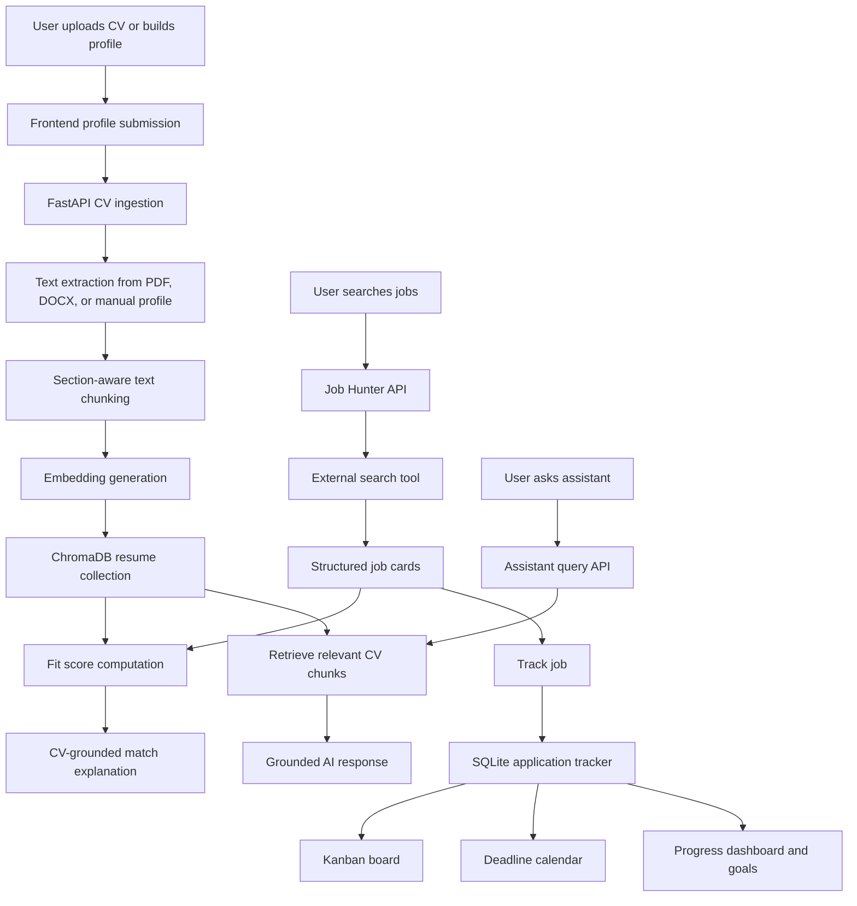

# CareerPilot Architecture

## Data Flow

## Component Responsibilities

| Layer | Responsibility |
| --- | --- |
| Next.js frontend | User interface, profile gates, job search UI, assistant UI, tracker UI |
| FastAPI backend | CV ingestion, job search orchestration, RAG retrieval, tracker APIs |
| RAG service | Text extraction, chunking, embedding, vector search, fit scoring |
| ChromaDB | Stores semantic CV chunks for retrieval |
| SQLite | Stores tracked applications and status history |
| Gemini API | Primary text-generation provider for grounded explanations, assistant answers, cover letters, nudges |
| Groq API | Backup text-generation provider when the primary provider is rate-limited or unavailable |
| Tavily API | Provides live external job search results |

## Key Design Rule

The user's CV is the source of truth. Job matching, assistant answers, cover letters, and roadmap suggestions must be grounded in retrieved CV context instead of generic assumptions.

## Main API Surface

| Endpoint | Purpose |
| --- | --- |
| `POST /api/cv-upload` | Upload and index a CV file |
| `POST /api/cv-manual` | Index manually entered profile data |
| `POST /api/search-jobs` | Search jobs and compute fit scores |
| `POST /api/query-cv` | Ask CV-grounded assistant questions |
| `GET /api/tracker` | List tracked applications |
| `POST /api/tracker` | Add an application to the kanban board |
| `PUT /api/tracker/{id}` | Update application status |
| `DELETE /api/tracker/{id}` | Remove tracked application |
| `GET /api/tracker/ai-nudge` | Generate a progress nudge |
