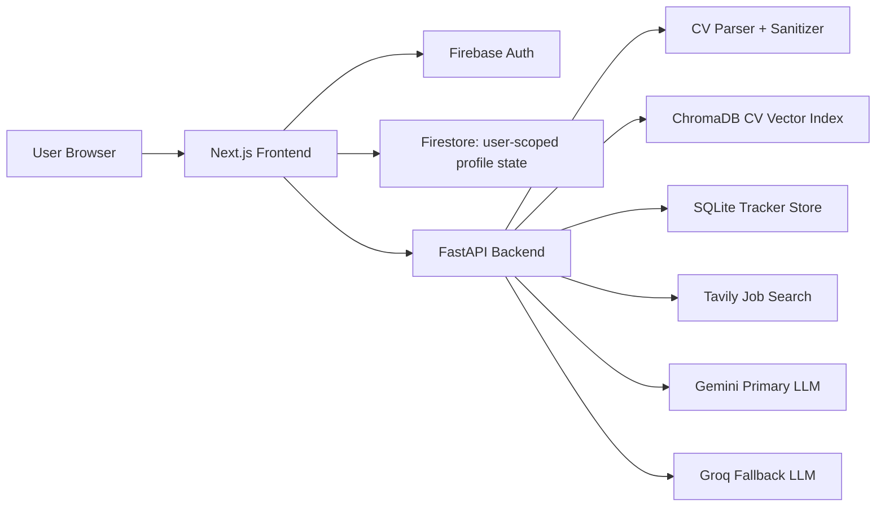

# CareerPilot Architecture

## System Overview

CareerPilot is built as a full-stack AI career workspace. The frontend owns the user experience, Firebase owns identity and user-scoped cloud state, and the FastAPI backend owns CV processing, retrieval, job enrichment, tracker APIs, and AI provider orchestration.



## Main Product Flow

1. User signs in with Firebase.
2. User uploads a CV or builds a manual profile.
3. Backend validates the file, extracts text, chunks it, and indexes CV content.
4. User searches for jobs in natural language.
5. Backend retrieves jobs, compares role requirements against the CV, generates fit scores, and returns ranked cards.
6. User can ask AI about a selected job. The assistant receives both selected-job context and saved CV context.
7. User tracks jobs into the tracker, adds deadlines/goals, and views progress analytics.

## Data Isolation

CareerPilot is designed around user-scoped data:

- Firebase `uid` identifies the signed-in user.
- Frontend profile, CV metadata, photo, and UI state are scoped by `uid`.
- Firestore rules restrict reads and writes to the authenticated user's own document tree.
- Backend endpoints can verify Firebase ID tokens when `REQUIRE_FIREBASE_AUTH=true`.
- Tracker and CV operations receive user context so separate users do not overwrite each other's workspace.

Recommended Firestore rule:

```js
rules_version = '2';
service cloud.firestore {
  match /databases/{database}/documents {
    match /careerpilot_users/{userId}/{document=**} {
      allow read, write: if request.auth != null && request.auth.uid == userId;
    }
  }
}
```

## AI Provider Strategy

CareerPilot uses Gemini as the primary model because it provides strong reasoning for CV/job comparison and career guidance. Groq is configured as a fallback so the demo can continue when the primary provider is rate-limited or unavailable.

The backend avoids hardcoded responses. If AI enrichment fails, the app still returns useful job data and shows user-friendly messages instead of backend errors.

## Security Architecture

- Firebase Auth controls identity.
- Optional backend token verification prevents unsigned API use in production.
- CORS is allowlisted.
- Security headers are set on frontend and backend responses.
- File uploads are validated by extension, content type, filename, and size.
- User input is sanitized and bounded before reaching AI/search services.
- Error messages are generic and do not expose system paths, stack traces, or secrets.

## Deployment Shape

Development:

- Frontend: `localhost:3000`
- Backend: `localhost:8000`
- Firebase: hosted auth and Firestore

Docker:

- `frontend` service builds and serves the Next.js app.
- `backend` service serves FastAPI.
- Named volumes persist upload and vector directories during container runs.

Production recommendation:

- Frontend on Vercel/Netlify.
- Backend on Render/Fly.io/Railway.
- Firestore for durable user state.
- Managed Postgres and managed vector DB if scaling beyond demo.
