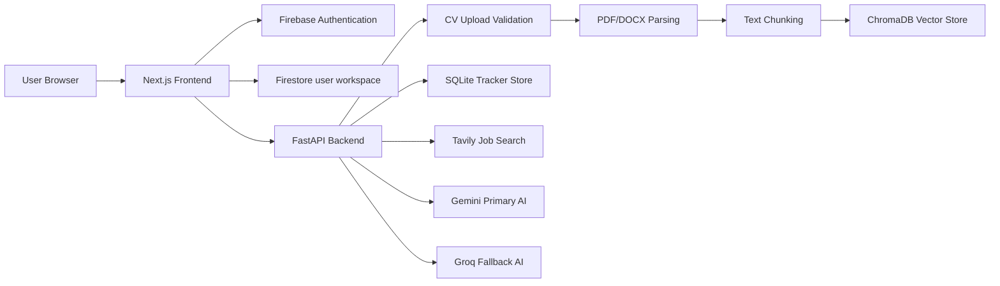

# CareerPilot System Design Document

## 1. Product Goal

CareerPilot is a CV-grounded career workspace for job seekers. It helps a user upload or build a CV, discover fit-ranked jobs, ask an AI assistant about selected roles, draft application content, and track applications, deadlines, goals, and weekly progress.

The main design principle is simple: the user's CV/profile becomes the source of truth for the entire job-search workflow.

## 2. High-Level Architecture



## 3. Core Data Flow

### CV Flow

1. User signs in with Firebase.
2. User uploads a CV or creates a manual profile.
3. Frontend sends authenticated request to the backend.
4. Backend validates file type, size, and filename.
5. Backend extracts text, sanitizes content, chunks the CV, and stores semantic chunks.
6. Frontend saves CV metadata and profile state under the authenticated user's workspace.
7. Job Hunter and Assistant use this saved profile context.

### Job Matching Flow

1. User enters a natural-language search query.
2. Backend searches jobs through Tavily.
3. Results are normalized into consistent job cards.
4. CareerPilot compares each job against CV/profile context.
5. AI generates practical match explanations when provider capacity is available.
6. Frontend sorts by best match by default and supports additional sort modes.

### Selected-Job Assistant Flow

1. User clicks `Ask AI` on a job card.
2. Assistant receives selected job context: title, company, location, deadline, salary, URL, match score, and fit reason.
3. Assistant also receives saved CV/profile context.
4. Response focuses on fit, gaps, next steps, and application strategy.
5. Chat persists until the user clears it.

### Tracker Flow

1. User tracks a job from Job Hunter.
2. Job enters the application tracker.
3. If a deadline is available, it appears in the calendar.
4. If no deadline is found, user receives a short manual deadline prompt.
5. Dashboard updates applications, statuses, goals, streaks, and activity.

## 4. Current Storage Design

| Data | Current Storage | Reason |
| --- | --- | --- |
| Identity | Firebase Auth | Managed secure authentication |
| User profile state | Firestore + local cache | Per-user persistence |
| CV metadata | Firestore + local cache | Prevent repeated uploads |
| CV chunks | ChromaDB | Semantic retrieval for CV-grounded AI |
| Tracker records | SQLite | Fast MVP persistence |
| Temporary CV files | Backend storage | Parsing pipeline |

## 5. User Isolation

User isolation is based on Firebase `uid`.

Recommended Firestore rule:

```js
rules_version = '2';
service cloud.firestore {
  match /databases/{database}/documents {
    match /careerpilot_users/{userId}/{document=**} {
      allow read, write: if request.auth != null && request.auth.uid == userId;
    }
  }
}
```

For production backend protection:

```env
REQUIRE_FIREBASE_AUTH=true
```

## 6. Scaling to 10,000 Users

| Area | MVP | 10,000-user upgrade |
| --- | --- | --- |
| Relational data | SQLite | Postgres with indexed user/application tables |
| Vector storage | Local ChromaDB | Managed vector DB or hosted Chroma with user namespaces |
| File storage | Local temp folder | Firebase Storage or S3 with authenticated rules |
| AI calls | Direct provider calls | Retry budget, caching, queueing, provider health checks |
| Job search | Live API call | Cached query results and pagination |
| CV processing | Request-time work | Background queue with status updates |
| Observability | Local logs | Structured logs, latency metrics, provider dashboards |
| Security | Local-friendly defaults | Strict CORS, HTTPS, token verification, rate limiting |

## 7. Estimated Cost Per User Per Month

Assumptions:

- 10,000 registered users.
- 2,000 monthly active users.
- Each active user uploads/replaces one CV per month.
- Each active user performs 10 job searches per month.
- Each active user sends 20 assistant messages per month.

Cost drivers:

| Component | Driver | Cost Control |
| --- | --- | --- |
| LLM | Explanations, chat, cover letters | Prompt limits, fallback model, caching |
| Search | Tavily job discovery | Query cache, debounce, result reuse |
| Vector DB | CV chunks | Delete replaced CV chunks, namespace by user |
| Backend | API traffic | Autoscaling container |
| Database | Tracker/profile reads/writes | Indexed queries |
| Storage | CV files and metadata | Store parsed text or encrypted files only when needed |

Expected MVP cost is mostly driven by AI and search usage, not frontend hosting. Reusing CV embeddings and caching common searches keeps cost per active user low.

## 8. Key Bottlenecks

| Bottleneck | Risk | Mitigation |
| --- | --- | --- |
| AI provider quota | Slow or missing AI responses | Gemini timeout budget + Groq fallback |
| Search latency | Job Hunter feels slow | Batch results, cache, loading states |
| PDF parsing quality | Bad extraction reduces match quality | Manual CV builder and DOCX support |
| SQLite concurrency | Not production scale | Move to Postgres |
| Local vector DB | Hard to horizontally scale | Managed vector DB |
| Long chat responses | Poor UI usability | Auto-scroll, copy action, response limits |
| Secrets | API key leakage | Environment variables and private `.env` files |

## 9. Reliability Strategy

- Gemini is primary for reasoning quality.
- Groq is fallback when Gemini is unavailable or rate-limited.
- User-facing errors are generic.
- Search and tracker remain usable even if AI enrichment is temporarily unavailable.
- Saved CV metadata prevents repeated uploads after reload or server restart.

## 10. Security Strategy

- Firebase Auth for identity.
- Firestore user-scoped rules.
- Optional backend Firebase token verification.
- Input validation and sanitization.
- Safe file upload checks.
- Security headers.
- No stack traces, provider errors, or local paths shown to users.

## 11. Production Roadmap

1. Move tracker data to Postgres.
2. Move uploaded files to Firebase Storage or S3.
3. Use managed vector storage.
4. Add background jobs for CV parsing and AI enrichment.
5. Add rate limiting per authenticated user.
6. Add monitoring for AI/search provider failures.
7. Add email reminders for application deadlines.
